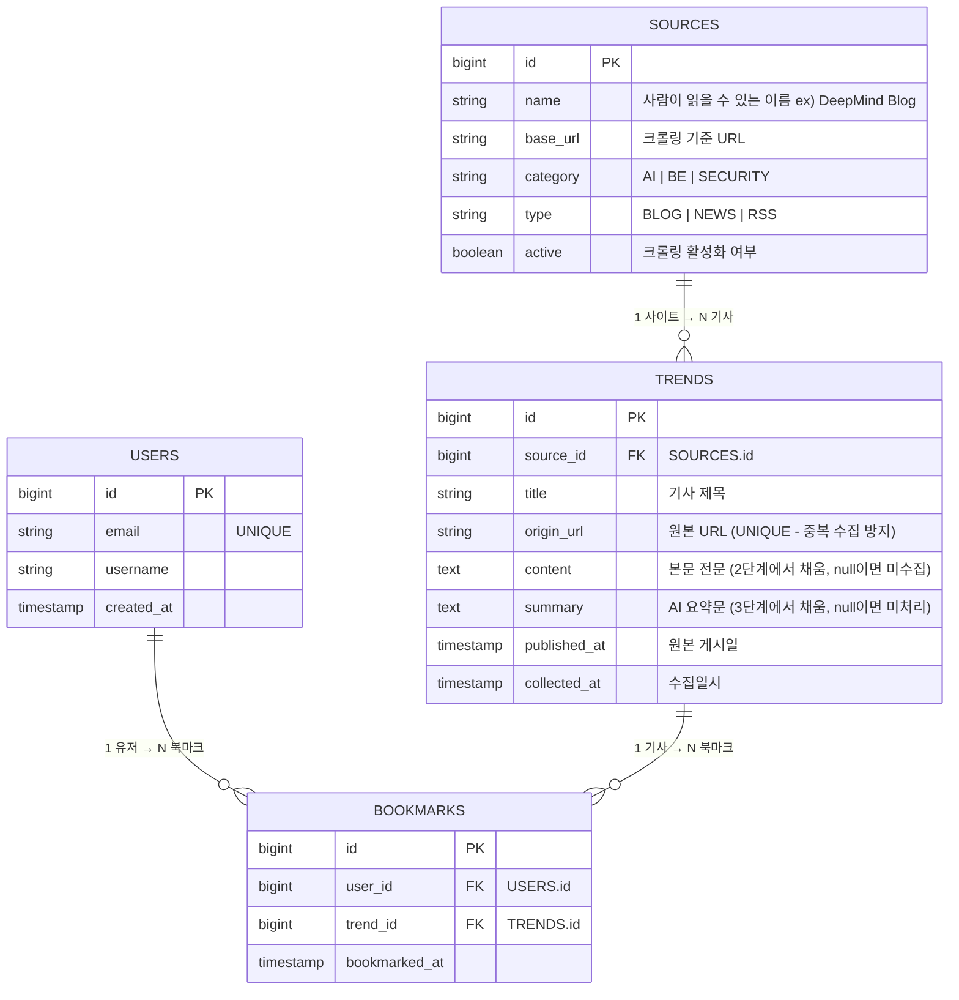

## 데이터 저장 흐름

```
1단계 (매일 09:00) - 목록 수집
  SOURCES 테이블에서 active=true 인 사이트 목록을 읽음
  → 각 파서로 기사 목록 수집
  → origin_url 중복 체크 후 신규 기사만 TRENDS에 INSERT
  → 이 시점에서 content = null

2단계 (매일 10:00) - 본문 수집
  TRENDS에서 content IS NULL 인 행만 조회
  → source_id로 어떤 파서 쓸지 결정
  → 본문 크롤링 후 content UPDATE

3단계 (추후) - AI 요약
  TRENDS에서 content IS NOT NULL AND summary IS NULL 인 행 조회
  → AI API 호출 후 summary UPDATE
```

## 설계 의도 및 변경 사항

| 항목 | 변경 전 | 변경 후 | 이유 |
|---|---|---|---|
| `Sources.name` | 없음 | 추가 | 사람이 읽을 수 있는 사이트명 필요 |
| `Sources.active` | 없음 | 추가 | 코드 수정 없이 크롤링 ON/OFF 가능 |
| `Sources.category` | 없음 | 추가 | 카테고리를 Sources에서 관리 (Trends에서 제거) |
| `Trends.category` | 있음 | 제거 | 어차피 사이트별로 카테고리 고정 → Sources에서 상속 |
| `Trends.text` | 있음 | 제거 | content와 역할 중복, 모호함 |
| `Trends.summary` | 없음 | 추가 | AI 요약 결과 저장 (null = 미처리) |
| `Trends.origin_url` | 있음 | UNIQUE 명시 | 중복 수집 방지 핵심 컬럼 |
| `Bookmarks.bookmark` | Bookmarks 자기참조 (버그) | Trends 참조로 수정 | 명백한 버그 |
